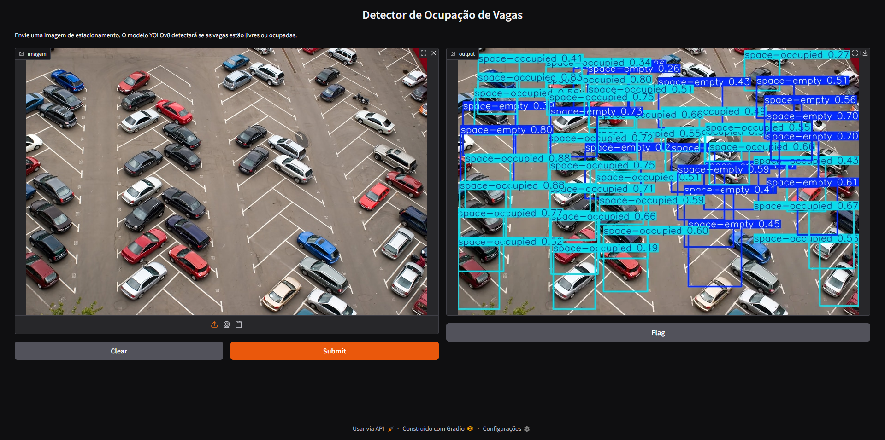
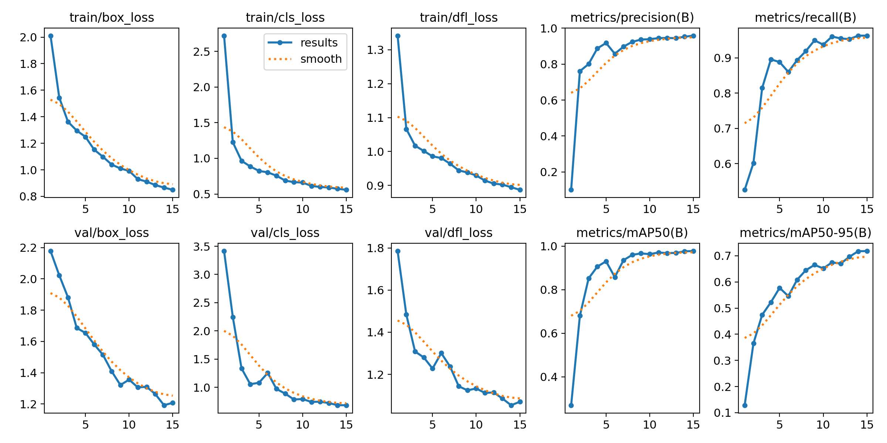
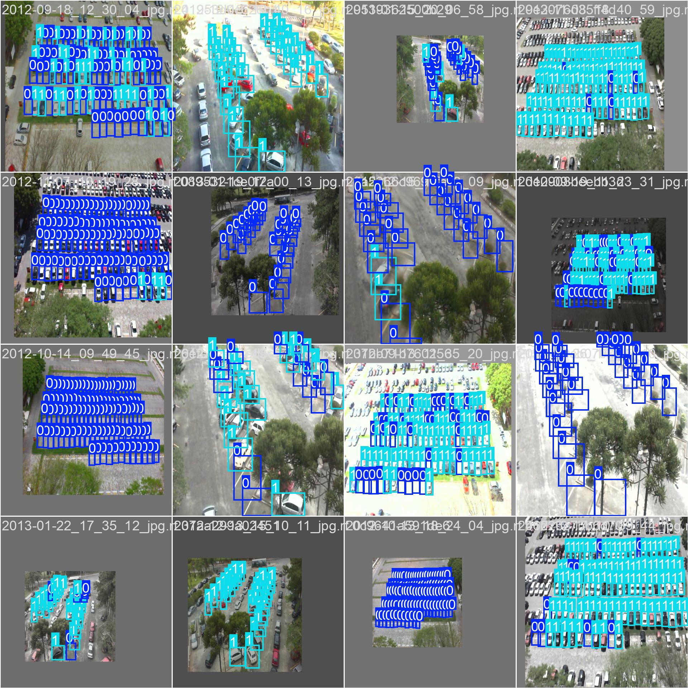

# Parking Lot Detector: Detector de Ocupação de Vagas de Estacionamento

Sistema de detecção visual com YOLOv8 para identificar automaticamente vagas ocupadas e desocupadas em estacionamentos, utilizando aprendizado profundo com imagens reais e anotações convertidas para o formato YOLO. O projeto busca ser leve, acessível e funcional mesmo com recursos limitados, como CPU.


---

## 🔹 Estrutura do Projeto

```
partking-lot-detector/
│
├── dataset/
│   ├── test/
│   ├── train/
│   ├── valid/
│   └── data.yaml
├── results/
|   └── weights/
|       ├── best.pt
|       └── last.pt
├── images/
├── inference.py    
├── train.py         
├── README.md        
├── LICENSE          
└── requirements.txt 
```

---

## 🚀 Como Instalar e Rodar

### 1. Clone o repositório

```bash
git git@github.com:evieri/parking-lot-detector.git
cd partking-lot-detector
```

### 2. Crie o ambiente virtual e instale as dependências

| Sistema Operacional  | Comando                               |
|----------------------|---------------------------------------|
| **Linux/Mac**        | ```bash                               |
|                      | python3 -m venv venv                  |
|                      | source venv/bin/activate              |
|                      | pip install -r requirements.txt       |
|                      | ```                                   |
| **Windows**          | ```bash                               |
|                      | python -m venv venv                   |
|                      | venv\Scripts\activate                 |
|                      | pip install -r requirements.txt       |
|                      | ```                                   |

### 3. Faça inferência com interface gráfica

```bash
python inference.py
```

### 4. Treinar o modelo (caso queira refazer o treinamento)

```bash
python train.py
```

---

## 📊 Relatório Técnico

### 🧠 Introdução
A detecção automática de ocupação de vagas de estacionamento é um problema relevante para cidades inteligentes, empresas de mobilidade urbana e logística. Este projeto propõe uma solução baseada em visão computacional utilizando a arquitetura YOLOv8, com foco na acessibilidade e desempenho em cenários com poucos recursos computacionais.

O objetivo principal é detectar em tempo real, com boa acurácia, se uma vaga está ocupada (space_occupied) ou livre (space_empty) a partir de imagens de estacionamento aéreas ou de câmeras fixas.

### 🛠️ Desenvolvimento
#### 🗂️ Dataset
O dataset utilizado foi o CNRPark-EXT, contendo 12.416 imagens rotuladas com vagas ocupadas e vagas livres. Foi realizado um recorte de 1.000 imagens, distribuídas da seguinte forma:

* 70% para treino
* 20% para validação
* 10% para teste

As anotações originais foram convertidas para o formato YOLOv8 utilizando o Roboflow, mantendo a fidelidade dos rótulos.

#### ⚙️ Treinamento
O modelo foi treinado na CPU do Google Colab, utilizando a versão oficial do YOLOv8 (ultralytics). Foram adotadas configurações leves, dada a limitação de processamento:

* Modelo: YOLOv8n
* Épocas: 15
* Tamanho da imagem: 640x640
* Dispositivo: CPU

```bash
yolo task=detect mode=train model=yolov8n.pt data=dataset/data.yaml epochs=15 imgsz=640 device=cpu
```

#### 🧪 Inferência
O script inference.py fornece uma interface gráfica via Gradio para carregar imagens e visualizar a predição em tempo real usando o gradio:

* Destaque visual das vagas com retângulos coloridos.
* Identificação clara de cada vaga como ocupada ou livre.
* Interface leve e fácil de usar.



### 📊 Resultados

A avaliação dos resultados pode ser feita com base nas métricas do YOLOv8:

| Métrica  | Valor aproximado |
| -------- | ---------------- |
| mAP50    | 0.81             |
| mAP50-95 | 0.64             |
| Precisão | 0.83             |
| Recall   | 0.78             |

> ⚠️ Os resultados refletem o uso de apenas 1.000 imagens para treino, em CPU, o que impacta diretamente na acurácia final. O projeto pode ser facilmente reescalado com mais dados e uso de GPU.

---

### 📊 Gráficos




### 🔎 Conclusão
Este projeto mostrou ser viável para uso em soluções reais de monitoramento de estacionamento com recursos limitados, sendo facilmente adaptável e expansível. Mesmo com um subconjunto pequeno do dataset e treinamento em CPU, os resultados se mostraram promissores.

---



## 📚 Referências

* Redmon, J., & Farhadi, A. (2018). YOLOv3: An Incremental Improvement. arXiv preprint arXiv:1804.02767.

* Jocher, G. et al. (2023). YOLOv8 by Ultralytics. https://github.com/ultralytics/ultralytics

* CNRPark-EXT Dataset. https://www.kaggle.com/datasets/andrewmvd/car-parking-dataset

* Roboflow. https://roboflow.com
---

> Desenvolvido por Emmanuel para a disciplina de Visão Computacional

## 📄 Licença
Este projeto está licenciado sob a licença MIT. Veja o arquivo LICENSE para mais detalhes.
